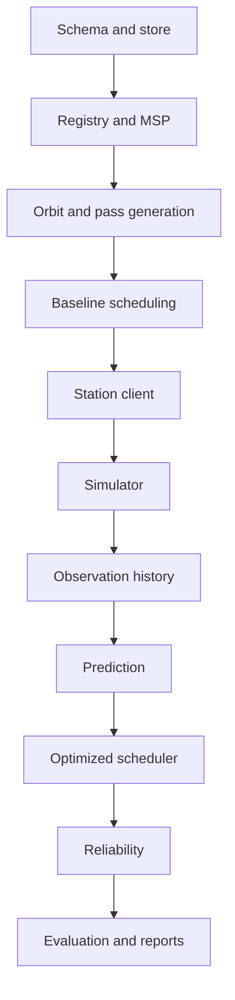
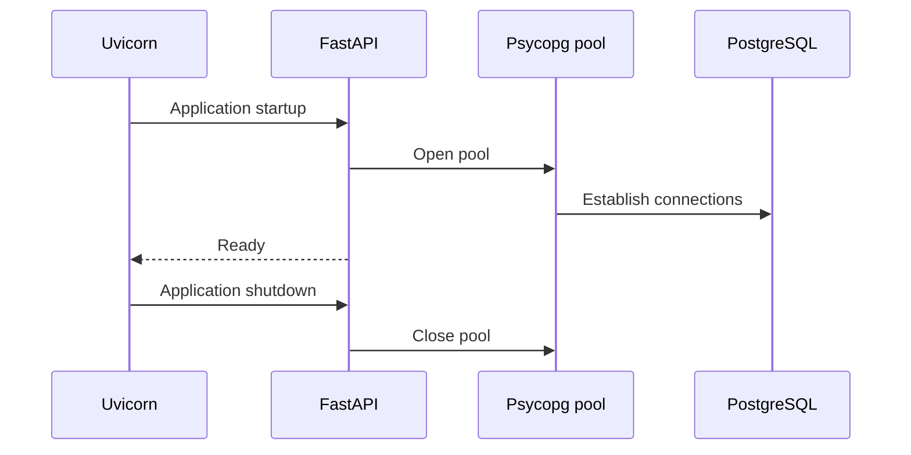
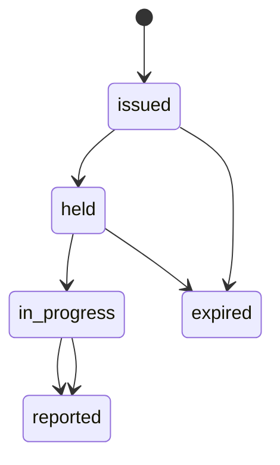
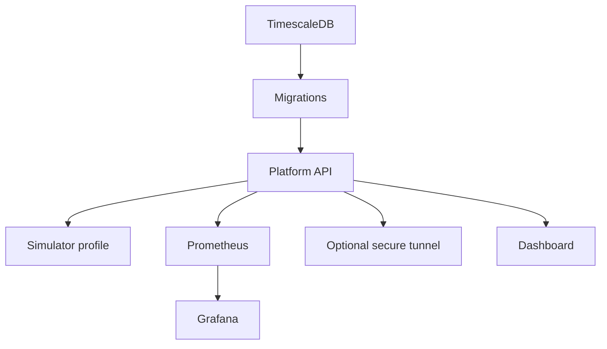
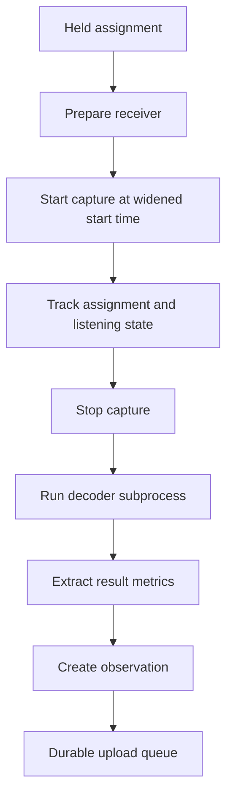

# Complete software implementation roadmap

This plan covers the complete software system, including items currently marked as Phase 2, Phase 3, deferred, or absent. It excludes:

- firmware;
- antennas, rotators, SDR wiring, and physical construction;
- RF hardware calibration;
- physical deployment work.

The station client software, receiver/decoder interfaces, simulator, platform, dashboard, data analysis, and deployment automation remain included.

---

# Guiding implementation strategy

Build Meridian in **vertical, demonstrable increments**:

1. Make the database and CI reliable.
2. Implement one protocol operation end to end.
3. Add orbit and pass generation.
4. Deliver assignments through MSP.
5. Accept observations.
6. Make one simulated station visible publicly.
7. Add prediction and optimized scheduling.
8. Add reliability and failure handling.
9. Add reproducible evaluation and reporting.
10. Harden the complete system.

Do not start prediction, optimization, or reliability until the operational data path works:



---

# Stage 0 — Resolve specification gaps

Before implementing endpoints, close the protocol contradictions that would otherwise cause rewrites.

## Learn

- API contract design;
- protocol versioning;
- idempotency and retry semantics;
- distributed-system failure cases;
- database transactions and concurrency;
- difference between an identifier, revision, hash, and idempotency key.

## Decide and document

### Registration recovery

A registration response contains the only copy of the bearer token. If the database commit succeeds but the response is lost, the invite is consumed and the client has no token.

Choose one recovery mechanism, such as:

- a registration idempotency key and recoverable pending registration;
- or an operator-issued replacement invite;
- or a short-lived registration recovery secret.

Do not implement registration until this is specified.

### Re-registration after `401`

MSP currently suggests re-registering after unauthorized access, but invites are single-use. Specify whether:

- the operator issues another invite;
- the platform supports credential rotation;
- or a separate recovery credential exists.

### Clock-offset sign

Define one convention everywhere:

```text
clock_offset = station clock - platform clock
```

or:

```text
clock_offset = platform clock - station clock
```

Update the formula, client, API documentation, tests, and timing analysis together.

### Assignment delivery policy

Define:

- how far into the future assignments are returned;
- whether held assignments are redelivered;
- how lost heartbeat responses recover;
- how many assignments remain pending after the response limit of eight;
- when assignments are eligible for reissue;
- whether Phase 2 adds a `revoked` state.

### Observation identity

Define a stable public `observation_id`. The database has internal revision information, but the MSP acknowledgement requires an identifier.

### Missing heartbeat fields

Add decisions for:

- storing `listening.mode`;
- propagating `simulated` to heartbeats;
- maximum health-object size;
- request-size limits.

### Open decisions

Resolve the existing open questions:

- product upload inline versus object storage/pre-signed URL;
- heartbeat polling versus pushed assignments;
- how a station declares a known horizon obstruction;
- maximum Doppler sample count versus compressed curve representation.

## Deliverable

A new accepted decision entry for every resolved point, followed by MSP and data-model updates.

## Completion gate

A registration, heartbeat, assignment, and observation lifecycle can be explained without undefined recovery behaviour.

---

# Stage 1 — Repair the development foundation

The current repository has a good skeleton, but the clean-database CI path is incomplete.

## Learn

- `uv` workspaces;
- Python `src/` layouts;
- Hatchling packaging;
- Ruff and strict Mypy;
- Pytest fixtures and markers;
- GitHub Actions service containers;
- Docker Compose dependency and health checks;
- Alembic revision flow.

## Implement

### Fix migration execution in CI

The CI starts TimescaleDB and runs tests, but does not apply migrations first.

Add:

```text
start TimescaleDB
    ↓
alembic upgrade head
    ↓
run integration tests
```

### Add migration lifecycle tests

Test:

- empty database → latest schema;
- applying migrations twice is safe at the Alembic level;
- expected views and constraints exist;
- revisions are in the correct order;
- downgrade behaviour is explicitly unsupported if that remains the policy.

### Fix executable mismatches

Currently declared but absent:

- `meridian.cli:main`;
- `meridian_sim.station`.

The README also contains an obsolete simulator module path.

Initially, add executable shells that fail with clear “not implemented” messages, then replace them in later stages.

### Deployment hygiene

Add:

- `.dockerignore`;
- pinned container versions instead of floating `latest` tags;
- image-build CI;
- dependency lock verification;
- Compose configuration validation;
- a Docker image smoke test.

### Improve test organization

Use:

```text
tests/
├── unit/
├── integration/
├── msp_conformance/
└── e2e/
```

Make commands explicit:

```sh
uv run pytest -m "not integration and not e2e"
uv run pytest -m integration
uv run pytest -m e2e
```

## Completion gate

A clean checkout can:

1. install dependencies;
2. start TimescaleDB;
3. apply all migrations;
4. pass lint, format, types, unit tests, and integration tests;
5. build the API image.

---

# Stage 2 — Implement the SQL access layer

Complete the store before adding business logic to API routes.

## Learn

- PostgreSQL transactions;
- Psycopg 3 connection pools;
- parameterized SQL;
- row locking;
- transaction isolation;
- TimescaleDB hypertables;
- PostgreSQL arrays and JSON;
- frozen dataclasses as persistence results;
- repository/service separation without an ORM.

## Implement

Suggested structure:

```text
platform/src/meridian/store/
├── __init__.py
├── pool.py
├── invites.py
├── stations.py
├── satellites.py
├── passes.py
├── assignments.py
├── observations.py
└── heartbeats.py
```

### Database pool

Create one Psycopg connection pool in the FastAPI lifespan:



Replace per-request direct connections where appropriate, including health checks.

### Store functions

Implement narrow operations, for example:

- lock and consume an invite;
- create a station and capabilities;
- find a station by token hash;
- append a heartbeat;
- update station liveness;
- list assignments due for a station;
- transition assignment state;
- insert or retrieve an observation revision;
- select public station summaries.

Do not place domain decisions in SQL store functions. Store functions should persist and retrieve; registry, observations, orbit, scheduler, and reliability services make decisions.

### Transaction boundaries

Create explicit transactions for:

- registration;
- heartbeat and assignment reconciliation;
- observation revision and assignment completion;
- pass generation;
- schedule publication.

## Tests

Against real PostgreSQL/TimescaleDB:

- transaction rollback;
- concurrent invite consumption;
- concurrent observation revisions;
- connection pool startup/shutdown;
- malformed client timestamps;
- correct simulation provenance;
- no plaintext tokens in storage.

## Completion gate

Every operational table can be read and written through typed store functions without API code containing SQL.

---

# Stage 3 — Implement shared MSP infrastructure

Do this once before writing individual endpoints.

## Learn

- FastAPI routers and dependencies;
- Pydantic v2 models;
- HTTP authentication;
- exception handlers;
- protocol content negotiation/versioning;
- stable machine-readable errors;
- API contract testing;
- rate limiting;
- secret-safe logging.

## Implement

Suggested structure:

```text
platform/src/meridian/api/
├── app.py
├── dependencies.py
├── errors.py
├── versioning.py
├── models/
│   ├── common.py
│   ├── registration.py
│   ├── heartbeat.py
│   ├── assignments.py
│   └── observations.py
├── msp.py
└── public.py
```

### Version parsing

For every `/msp/v0/*` endpoint:

- require `MSP-Version`;
- reject missing or malformed versions;
- reject unsupported major versions;
- accept compatible minor versions under major `0`.

### Fixed errors

All MSP errors must have exactly:

```json
{
  "error": "stable_code",
  "message": "Human-readable explanation"
}
```

Replace FastAPI’s default `422` response with MSP’s `400 malformed`.

Map:

- validation failures;
- malformed JSON;
- authentication failures;
- missing assignments;
- rate limits;
- internal errors.

Do not expose stack traces, SQL, invite tokens, or bearer tokens.

### Request limits

Set bounded sizes for:

- health JSON;
- product metadata;
- Doppler arrays;
- registration fields;
- overall request body.

### Observability

Add low-cardinality metrics:

- request count by endpoint and status;
- request latency;
- stable MSP error code;
- heartbeat ingestion count;
- observation ingestion count;
- registration success/failure count.

Never use station IDs, satellite IDs, or tokens as Prometheus labels unless cardinality is tightly controlled.

## Tests

Create golden protocol fixtures and exact-shape tests.

Every endpoint should be tested for:

- missing version;
- malformed version;
- unsupported major;
- malformed JSON;
- wrong field type;
- unexpected field policy;
- internal failure;
- exact error body;
- no secret leakage.

## Completion gate

A new MSP endpoint can be added without recreating versioning, authentication, validation, error, logging, or metrics behaviour.

---

# Stage 4 — Implement time and registration

These are the first complete MSP operations.

## 4.1 Time endpoint

### Platform

Implement:

```http
GET /msp/v0/time
MSP-Version: 0.1
```

Response:

```json
{
  "server_time": "2026-08-02T12:34:56.123Z"
}
```

It should:

- require protocol version;
- require no authentication;
- access no database;
- return UTC.

### Client

Implement a shared `httpx` transport and clock estimator.

Estimate clock offset using the local send/receive midpoint:

```text
local midpoint = sent_at + RTT / 2
offset = server_time - local midpoint
uncertainty ≥ RTT / 2
```

Use whichever sign convention Stage 0 accepts.

Never represent unknown clock uncertainty as zero.

---

## 4.2 Invite CLI

Implement:

```sh
meridian invite create
meridian invite list
meridian invite revoke
```

Invite requirements:

- generated with `secrets`;
- only hashes stored;
- optional expiry;
- human-readable label;
- one-time consumption;
- plaintext displayed only once.

Implement environment bootstrap so `REGISTRATION_INVITE_TOKEN` seeds one invite in a new database without overwriting or recreating consumed invites.

---

## 4.3 Registration

### Registry service

Implement a concrete registry class behind the existing protocol.

Responsibilities:

- validate invite;
- generate station ID;
- generate opaque bearer token;
- hash bearer token with the selected pepper scheme;
- insert station and capabilities;
- consume invite atomically;
- return plaintext bearer token once.

### API

Implement:

```http
POST /msp/v0/register
```

Validate:

- name and operator;
- latitude, longitude, and required altitude;
- capabilities;
- frequency ranges in integer Hz;
- client implementation and version;
- top-level `simulated`;
- simulator run ID and seed when simulated.

Simulation provenance must come from registration and become authoritative. Later observation payloads must not be allowed to override it.

### Client

Implement:

- registration payload construction;
- atomic credential persistence;
- restricted file permissions where supported;
- safe replacement of old credentials;
- no invite retention after success;
- Stage 0 recovery semantics;
- actionable handling of invalid or expired invites.

## Completion gate

A fresh software client can:

1. query platform time;
2. use a one-time invite;
3. register;
4. restart;
5. reuse its stored station identity and bearer token.

---

# Stage 5 — Implement authentication and registry health

## Learn

- bearer authentication;
- cryptographic random generation;
- secure hashing and peppers;
- constant-time comparison;
- token revocation;
- liveness versus reported state;
- interval-overlap queries.

## Implement

### Authentication

For protected MSP endpoints:

- parse `Authorization: Bearer …`;
- hash the supplied token;
- use constant-time comparison where direct comparison applies;
- reject missing, invalid, revoked, or deleted-station tokens;
- reject using one station’s token with another station ID;
- never reveal whether a particular station exists.

### Registry operations

Implement:

```python
authenticate()
liveness()
was_listening()
```

Liveness:

- `never_seen`: no heartbeat;
- `online`: heartbeat age below stale threshold;
- `stale`: two missed heartbeat intervals;
- `offline`: three missed heartbeat intervals.

`was_listening()` must prove overlap with:

- the pass time;
- the satellite;
- the center frequency;
- a valid station assignment.

This method becomes the only authority reliability uses to classify absence.

### Background liveness process

Choose one:

- derive liveness dynamically when queried;
- or update it through a periodic background job.

Dynamic calculation avoids stale stored values. A periodic job is still useful for alerts and status transitions.

## Completion gate

Token revocation is immediate, liveness is deterministic, and listening evidence can be answered from heartbeat history.

---

# Stage 6 — Implement orbit propagation and archive

This can be developed independently after the store interface stabilizes.

## Learn

- TLE/element-set format;
- SGP4;
- Skyfield;
- UTC and Julian dates;
- TEME, ECEF, and topocentric coordinate frames;
- azimuth, elevation, range, and range rate;
- horizon crossing detection;
- numerical bisection;
- Doppler shift;
- property-based and reference-data testing.

## Implement

Suggested structure:

```text
platform/src/meridian/orbit/
├── types.py
├── service.py
├── skyfield_service.py
├── archive.py
├── sources.py
└── uncertainty.py
```

### Element-set archive

Implement append-only storage:

- satellite ID;
- epoch;
- TLE lines;
- source;
- retrieval time;
- provenance;
- content hash.

Never overwrite old element sets. Historical sets are needed for timing-error analysis.

External retrieval must not become a runtime dependency. The system should continue using the local archive during network outages.

### Orbit service

Implement all current protocol methods:

- `pass_windows()`;
- `look_angles()`;
- `doppler_curve()`;
- `timing_uncertainty()`;
- `element_set_divergence()`.

### Pass search

Use:

1. coarse elevation sampling;
2. crossing detection;
3. bisection refinement;
4. maximum elevation search;
5. explicit elevation floor.

### Azimuth continuity

Unwrap azimuth over a pass so a north crossing does not appear as a full rotation.

### Phase 1 uncertainty

Use a documented, conservative nonzero prior. Store the method name with every result.

### Tests

Use published/reference pass predictions rather than only self-generated values.

Test:

- known satellite and site;
- UTC enforcement;
- horizon crossings;
- short low-elevation passes;
- azimuth north crossing;
- element-set age;
- old versus new element-set divergence;
- Doppler sign;
- frame-conversion sensitivity;
- empty intervals;
- decayed or invalid element sets.

## Completion gate

Given a local element set and ground site, Meridian can independently generate reproducible pass windows, pointing samples, Doppler samples, and uncertainty.

---

# Stage 7 — Generate passes and baseline assignments

## Learn

- job design;
- idempotent batch processing;
- scheduling horizons;
- interval conflicts;
- station capability matching;
- deterministic tie-breaking;
- explainable decisions.

## Implement

### Pass-generation job

For every active station/satellite/transmitter combination:

1. select the appropriate element set;
2. confirm station frequency capability;
3. generate passes for a planning horizon;
4. store the element-set ID and elevation threshold;
5. copy simulation provenance;
6. avoid duplicate windows;
7. record uncertainty.

Expose through CLI:

```sh
meridian passes generate --from ... --to ...
```

Later it can run periodically inside a scheduler worker.

### Baseline scheduler

Implement configuration A first:

- rank by maximum elevation;
- reject overlapping passes;
- respect station frequency capabilities;
- include assignment-window widening;
- include deterministic tie-breaking.

Then implement configuration B:

- elevation plus operator priority.

For every candidate, record:

- selected or skipped;
- reason;
- score;
- conflicting assignment if relevant;
- configuration;
- input prediction version.

The reasoning must be generated during scheduling, not reconstructed later.

### Assignment state

Use:



Do not infer `not_attempted` merely because an assignment disappeared from a heartbeat.

## Completion gate

The platform can generate future passes and issue a valid, explained, non-overlapping assignment schedule without external services.

---

# Stage 8 — Implement heartbeat and assignment delivery

## Learn

- polling protocols;
- reconciliation;
- state machines;
- retries and replay safety;
- race conditions;
- platform-clock versus client-clock timestamps.

## Platform implementation

Implement:

```http
POST /msp/v0/heartbeat
```

In one transaction:

1. authenticate station;
2. validate heartbeat;
3. record `received_at` using platform time;
4. preserve station `sent_at`;
5. copy `simulated` from registry;
6. update station heartbeat information;
7. reconcile held assignments;
8. transition valid assignment states;
9. expire eligible old assignments;
10. return due assignments.

Response requirements:

- sorted by start time;
- maximum eight assignments;
- includes server time;
- includes complete execution information;
- includes the exact element set used;
- includes timing uncertainty;
- includes frequency, mode, priority, and predicted yield.

Unknown or foreign assignment IDs must not affect state.

## Client implementation

Build a reusable heartbeat loop that:

- uses the server-provided interval;
- sends `held_assignments`, including an empty array;
- persists assignments before accepting them;
- deduplicates by assignment ID;
- validates every assignment;
- continues holding work during network loss;
- never overlaps heartbeat requests;
- uses bounded exponential backoff and jitter;
- reports listening only while executing that assignment;
- updates clock estimates from server time.

Keep assignment execution separate from heartbeat networking. A temporary network outage must not cancel already downloaded work.

## Completion gate

A registered software client can receive, persist, hold, execute, and report the listening state of an assignment despite temporary platform unavailability.

---

# Stage 9 — Implement append-only observations

## Learn

- idempotency;
- canonical JSON;
- content hashes;
- append-only revisions;
- concurrent submissions;
- offline queues;
- eventual delivery.

## Platform implementation

Implement:

```http
POST /msp/v0/observations
```

### Validation

Check:

- assignment exists;
- assignment belongs to authenticated station;
- station and assignment agree;
- timestamps are ordered;
- `started_at` is within the accepted historical/future range;
- outcome is valid;
- signal fields are consistent;
- Doppler and products are bounded.

Derive rather than trust:

- satellite ID;
- simulation provenance;
- assignment relationship.

### Revision behaviour

For first submission:

- create revision 1;
- mark assignment reported;
- return `superseded: false`.

For an identical retry:

- return existing acknowledgement;
- insert nothing.

For changed content:

- append revision `n + 1`;
- preserve earlier revisions;
- return `superseded: true`.

Serialize content canonically before hashing. Define handling for:

- key ordering;
- timestamp format;
- numeric values;
- omitted fields versus `null`;
- array ordering.

Use a row or advisory lock to prevent concurrent duplicate revisions.

## Client implementation

Add a durable observation queue:

```text
assignment completes
    ↓
write observation to local queue
    ↓
attempt upload
    ↓
validate acknowledgement
    ↓
remove from queue
```

Requirements:

- persist before upload;
- retain original timestamps;
- survive process restart;
- retry transport, `429`, and `500`;
- stop automatic retries for permanent protocol errors;
- retain failed payloads for diagnosis;
- tolerate lost acknowledgements through platform idempotency.

A declined assignment creates no observation. `not_attempted` means it was held but execution never began.

## Completion gate

Stopping either platform or client at any point cannot create duplicate current observations or lose a completed result.

---

# Stage 10 — Complete the deterministic simulator

The simulator must exercise the real client and protocol, not platform internals.

## Learn

- deterministic pseudo-random generation;
- deriving independent per-station seeds;
- scenario modeling;
- discrete state machines;
- reproducible simulation;
- fault injection.

## Implement

Suggested structure:

```text
simulator/src/meridian_sim/
├── __init__.py
├── station.py
├── scenarios.py
├── outcomes.py
├── faults.py
└── config.py
```

### Reuse the reference client

The simulator should depend on:

```text
meridian-sim → meridian-client → HTTP → platform
```

It must not:

- import `meridian.store`;
- query PostgreSQL;
- call platform service objects;
- use hidden simulator-only endpoints.

### Deterministic behavior

Inputs:

- master seed;
- run ID;
- station count;
- capability profile;
- outcome model;
- fault scenario.

Derive independent streams:

```text
station_seed = deterministic_hash(master_seed, station_id)
```

Increasing station count must not alter station 1’s behavior.

### Simulate

- registration;
- heartbeat states;
- assignment acceptance and decline;
- listening;
- processing;
- successful decode;
- signal without decode;
- no signal;
- abort;
- not attempted;
- network interruption;
- process restart;
- token revocation;
- delayed observation upload.

Always register with:

```json
{
  "simulated": true,
  "simulator_run_id": "...",
  "seed": 4471
}
```

### CLI

Support:

```sh
python -m meridian_sim.station \
  --count 1 \
  --seed 4471 \
  --base-url http://api:8000
```

## Tests

- same seed produces identical canonical observations;
- different seed changes outcomes;
- station 1 remains unchanged when count increases;
- every generated row remains simulated;
- no database dependency;
- restart preserves credentials and queues;
- all MSP operations pass conformance fixtures.

## Completion gate

`docker compose --profile sim up` registers a virtual station, receives an assignment, submits an observation, and keeps simulation provenance at every layer.

---

# Stage 11 — Public API and dashboard

Implement this after there is real data to display.

## Learn

### Backend

- read-only REST API design;
- pagination and filtering;
- response schemas;
- cache headers;
- WebSocket or server-sent event tradeoffs.

### Frontend

No dashboard stack has been accepted yet. Make and document that decision.

A reasonable interactive stack would be:

- TypeScript;
- Vite;
- React;
- Leaflet for the station map;
- a lightweight chart library.

A lower-complexity alternative is FastAPI templates plus HTMX. Choose based on required interactivity and existing team knowledge, not fashion.

## Public API

Implement read endpoints for:

- stations;
- station details and capabilities;
- current liveness;
- recent heartbeats;
- satellites and transmitters;
- upcoming passes;
- assignments and reasons;
- current/recent observations;
- aggregate metrics;
- reliability summaries;
- simulator runs.

Every applicable response must include `simulated`.

Do not expose:

- tokens;
- invite hashes;
- sensitive operator data;
- internal health payloads without filtering;
- unrestricted raw station coordinates if privacy policy later requires approximation.

## Dashboard sequence

### First dashboard

- public station map;
- online/stale/offline status;
- simulated badge;
- last heartbeat;
- upcoming assignments;
- current listening state.

This satisfies the first major demonstrable milestone.

### Later views

- pass queue;
- scheduling reason;
- observation history;
- predicted versus actual outcomes;
- element-set age and uncertainty;
- reliability;
- loss budget;
- model calibration;
- simulated-versus-measured filtering.

## Completion gate

A simulated station is visible from outside the local network and clearly labelled simulated.

---

# Stage 12 — Complete deployment and monitoring

## Learn

- Docker Compose profiles;
- multi-stage images;
- multi-architecture builds;
- Prometheus metrics;
- Grafana provisioning;
- alert rules;
- secure tunnels;
- backup and restore;
- log rotation;
- secret management.

## Implement

### Compose stack

Required dependency flow:



### Prometheus metrics

Add domain metrics:

- station liveness counts;
- heartbeat ingestion delay;
- observation submission delay;
- assignments by state;
- pass-generation duration;
- scheduler runtime;
- scheduler candidate count;
- protocol errors;
- database pool utilization;
- confirmed misses;
- indeterminate outcomes;
- loss-budget remaining.

### Grafana

Provision from version-controlled files:

- data source;
- dashboards;
- alert rules;
- notification configuration templates.

### Alerts

At minimum:

- API unavailable;
- database unavailable;
- station stale/offline;
- heartbeat ingestion stopped;
- migration failure;
- scheduler not running;
- observation queue growing;
- loss-budget threshold reached.

### Operations

Implement documented commands for:

- backup;
- restore;
- invite creation;
- migration status;
- pass generation;
- scheduler execution;
- data snapshot;
- simulator execution;
- report generation.

## Completion gate

A clean machine can bring up the complete software stack within ten minutes, and an operator can understand failures through health checks, metrics, logs, and alerts.

---

# Stage 13 — Software-side receiver and decoder integration

This remains software work even though physical devices are excluded.

## Learn

- process boundaries;
- subprocess supervision;
- IPC;
- GNU Radio/SatDump execution models;
- file and stream lifecycle;
- timeout and cancellation;
- receive-only safety constraints.

## Implement interfaces

Inside the station client, define interfaces such as:

```python
class Receiver(Protocol):
    ...

class Decoder(Protocol):
    ...

class RotatorController(Protocol):
    ...
```

Provide:

- simulated receiver;
- file-replay receiver;
- null rotator;
- subprocess decoder adapter;
- optional standard-protocol rotator adapter.

Do not implement:

- RF transmit paths;
- error-correcting codes;
- demodulators already provided by established tools;
- rotator wire protocols.

GPL tools must run as separate processes. Do not copy or link GPL source into the Apache-2.0 Python distributions.

## Execution pipeline



Use simulated and file-replay adapters for automated tests. Physical adapters can remain unvalidated in this software-only plan.

## Completion gate

The station client can execute an assignment through a simulated or recorded-data pipeline and produce a valid observation without knowing anything about PostgreSQL.

---

# Stage 14 — External archive ingest

Only begin after Meridian works independently.

## Learn

- ETL design;
- source provenance;
- rate limiting;
- resumable downloads;
- immutable raw data;
- schema normalization;
- licensing and attribution;
- selection bias.

## Implement

Create:

```text
ingest/
├── adapters/
├── raw/
├── normalize/
├── manifests/
└── tests/
```

For every source, record:

- source name;
- original identifier;
- retrieval timestamp;
- source version;
- licence;
- checksum;
- transformation version.

The adapter must:

1. download into immutable raw storage;
2. validate and hash;
3. normalize independently;
4. load normalized records;
5. never overwrite original data;
6. never become required by the operational scheduler.

If implementation is informed by another project’s source, update `ATTRIBUTION.md` in the same change. Never copy GPL/AGPL source.

## Completion gate

An archive snapshot can be downloaded once, then repeatedly normalized and evaluated without network access.

---

# Stage 15 — Dataset snapshots and labeling

Prediction work must not begin directly against mutable production tables.

## Learn

- dataset versioning;
- data leakage;
- temporal feature computation;
- outcome taxonomy;
- selection bias;
- content-addressed snapshots;
- reproducible pipelines.

## Implement

Create immutable evaluation snapshots containing:

- observations;
- geometrically available passes;
- element sets and epochs;
- station capabilities effective at the time;
- priorities;
- heartbeats and listening evidence;
- simulation flags;
- outcome labels;
- exclusion reasons.

### Outcome labeling

Distinguish:

- successful reception;
- signal but no decode;
- confirmed miss;
- satellite silent;
- satellite state indeterminate;
- station unavailable;
- station not confirmed listening;
- cancelled/revoked assignment;
- simulated observation.

Only call something a confirmed miss when `Registry.was_listening()` proves it.

### Snapshot manifest

Include:

- snapshot ID;
- content hash;
- schema version;
- row counts;
- date range;
- source provenance;
- transformation version;
- simulation status.

## Completion gate

The same raw snapshot and transformation configuration always produce the same evaluation dataset hash.

---

# Stage 16 — Completeness and selection-bias tooling

This must precede model claims.

## Learn

- missing-not-at-random data;
- propensity scores;
- inverse-propensity weighting;
- overlap and positivity;
- effective sample size;
- sensitivity analysis.

## Implement

### Geometric opportunity denominator

Generate all geometrically available passes independently of archive observations.

Compute:

```text
completeness =
    observed eligible passes /
    geometrically available eligible passes
```

Calculate per station-day.

### Near-complete windows

Use a configurable threshold, initially `0.8`, for the primary retrospective evaluation.

Report:

- completeness distribution;
- retained and excluded station-days;
- sensitivity at multiple thresholds.

### Inverse-propensity weighting

Estimate:

```text
P(pass observed | historical policy information)
```

Do not include future outcome information.

Report:

- weighted and unweighted estimates;
- overlap diagnostics;
- weight distribution;
- clipping/floor policy;
- effective sample size:

```text
(Σw)² / Σ(w²)
```

## Completion gate

Every archive-derived result automatically includes completeness information and, where relevant, IPW diagnostics.

---

# Stage 17 — Prediction and learned profiles

## Learn

- feature engineering;
- temporal train/test splits;
- probability models;
- calibration;
- Brier score;
- cold-start handling;
- model artifact versioning;
- rolling-origin evaluation.

Add numerical/ML dependencies only now. A simple interpretable model should be the first choice, such as regularized logistic regression, before complex models.

## Implement features

### Geometry

- maximum elevation;
- pass duration;
- acquisition and loss azimuth;
- azimuth trajectory;
- element-set age.

### Station history

- recent health;
- recent decode rate;
- frequency-band history;
- per-satellite history.

### Learned environment

- horizon profile by azimuth;
- interference/noise profile by azimuth and hour;
- historical timing error;
- element-set divergence.

### Cold start

A new station must explicitly fall back to geometry-only prediction.

Test:

- new station;
- unseen satellite;
- missing interference history;
- missing health history.

## Model configurations

Implement by configuration, not code edits:

| Configuration | Inputs |
|---|---|
| A | Elevation only |
| B | Elevation plus priority |
| C | Project-derived features only |
| D | All combined |

Priority should remain a scheduling/objective weight rather than being misrepresented as a physical reception feature.

## Temporal evaluation

Use:

```text
past → train
later → validation
latest untouched interval → test
```

Never use random shuffled observation splits.

All learned transformations must fit on training data only.

## Calibration

Produce:

- probabilities bounded to `[0, 1]`;
- Brier score;
- training-period base-rate comparison;
- reliability diagram;
- calibration by station;
- calibration by band;
- calibration by element-set age;
- sample sizes and confidence intervals.

## Completion gate

Configurations A–D run from one config interface, use temporal splits, handle cold start, and produce reproducible calibrated probabilities.

---

# Stage 18 — Constrained scheduler

Do this after prediction because the scheduler consumes prediction outputs.

## Learn

- interval scheduling;
- mixed-integer optimization;
- objective functions;
- constraints;
- solver status and time limits;
- deterministic scheduling;
- retrospective oracle evaluation.

Select and document a solver at this stage. Do not build an optimizer manually if a maintained library provides the required model.

## Implement

### Constraints

- one station cannot execute overlapping assignments;
- include antenna slew and settling time;
- station must support frequency/mode;
- assignment must fit operational availability;
- pass must use an active transmitter;
- assignment windows include timing uncertainty;
- failed/offline stations receive no assignments.

### Objective

Combine:

- predicted successful yield;
- decoded frame estimate;
- operator priority;
- optional fairness or coverage terms.

Keep each term visible and configurable.

### Explanations

For selected and rejected candidates, record:

- score;
- prediction;
- priority;
- conflicts;
- active constraints;
- selected alternative;
- configuration and model version.

### Reissue

Implement the Stage 0 lifecycle decision for reassignment when a station declines or goes offline.

### Oracle

Implement a retrospective, nondeployable upper bound using known outcomes. It must obey the same physical and scheduling constraints.

## Evaluation

Give every scheduler:

- the same candidates;
- the same constraints;
- the same horizon;
- the same station state;
- the same runtime limit.

Compare:

- A;
- B;
- C;
- D;
- oracle upper bound.

The primary contribution is:

```text
D − B
```

not D minus the weakest possible baseline.

## Completion gate

The optimized scheduler always emits a constraint-valid schedule, records its reasoning, and can be compared reproducibly against baselines and an oracle.

---

# Stage 19 — Complete deferred storage

Implement tables only when their producers and consumers exist.

## Add

### `noise_measurements`

Raw measurements with:

- station;
- time;
- center frequency;
- bandwidth;
- azimuth;
- value;
- provenance;
- simulated.

### `interference_profiles`

Derived and versioned from noise measurements.

### `horizon_profiles`

Learned or declared profiles with:

- azimuth bin;
- minimum usable elevation;
- source/method;
- training interval;
- model/version;
- simulated status.

Keep declared obstruction and learned profile distinguishable.

### `products`

After upload semantics are settled:

- observation relationship;
- type;
- checksum;
- size;
- storage location;
- creation time;
- simulated provenance.

### Analytical views

- pass completeness;
- element-set divergence;
- timing error;
- current reliability indicators;
- scheduler performance.

### Retention and aggregates

Before deleting full-resolution heartbeats:

1. define required reliability queries;
2. create downsampled continuous aggregates;
3. verify aggregate completeness;
4. only then introduce retention.

## Completion gate

Every deferred table has an active producer, consumer, provenance policy, migration test, and retention decision.

---

# Stage 20 — Reliability and loss accounting

## Learn

- SLIs and SLOs;
- error/loss budgets;
- event classification;
- reliability windows;
- failure detection;
- false positives;
- incident timelines.

## Implement

### Miss classification

Centralize in `meridian.reliability`.

A pass counts as missed only if:

- it was assigned;
- the assignment was executable;
- registry evidence proves listening;
- satellite silence was not established;
- no successful observation exists.

Do not treat:

- no heartbeat;
- station offline;
- declined assignment;
- absent observation;
- cancelled schedule

as equivalent to a confirmed reception miss.

### SLIs

Implement:

- pass capture rate;
- confirmed miss rate;
- station availability;
- assignment completion rate;
- observation submission delay;
- schedule execution rate;
- failure detection latency.

### Irrecoverable loss budget

Unlike an HTTP request, a missed satellite pass cannot be retried. Record every debit with:

- pass;
- station;
- reason;
- evidence;
- simulation status;
- timestamp;
- budget impact.

### SLOs

Make thresholds configurable and documented. Keep simulated and measured SLOs separate.

## Completion gate

Every reliability number can be traced back to assignments, observations, and heartbeat evidence.

---

# Stage 21 — Failure injection and scale simulation

## Learn

- chaos testing;
- deterministic fault injection;
- failure detection latency;
- recovery testing;
- load testing;
- long-duration test design.

## Implement faults

Simulate:

- station disconnect;
- heartbeat delay;
- network partition;
- observation upload delay;
- client restart;
- platform restart;
- database restart;
- invalid token;
- clock drift;
- degraded decoder;
- assignment rejection;
- slow API;
- scheduler failure.

Record:

- fault type;
- target;
- seed;
- injection time;
- expected detection;
- alert time;
- replan time;
- recovery time.

Verify:

- offline detection within 90 seconds;
- no new assignments sent to failed station;
- scheduler replans;
- no false confirmed misses;
- recovery restores normal operation.

### Scale

Expand from:

1. one station;
2. five stations;
3. ten stations;
4. fifty stations.

Measure:

- heartbeat throughput;
- API latency;
- database pool pressure;
- assignment response latency;
- scheduler runtime;
- Prometheus cardinality;
- observation queue behavior.

### Long run

Run the complete software stack for 72 hours with simulated stations.

Record:

- crashes;
- restarts;
- alerts;
- false positives;
- data loss;
- queue growth;
- resource use.

## Completion gate

Fifty deterministic stations operate through real MSP, and injected failures are detected and handled without corrupting reliability metrics.

---

# Stage 22 — Reproducible evaluation and reports

## Learn

- experiment configuration;
- deterministic seeds;
- bootstrap confidence intervals;
- clustered data;
- report automation;
- artifact manifests.

## Analysis structure

Create:

```text
analysis/
├── configs/
├── snapshots/
├── features/
├── models/
├── scheduler/
├── reliability/
├── reports/
└── tests/
```

Prefer scripts/packages for final results. Notebooks may explore data, but final figures must be generated through deterministic commands.

## Every run records

- dataset snapshot ID and hash;
- config ID and hash;
- master seed;
- derived component seeds;
- code commit/version;
- dependency versions;
- temporal split;
- model artifact hash;
- solver version;
- sample size;
- exclusions;
- simulation status;
- generation time.

## Required reports

### Data

- provenance;
- snapshot manifest;
- outcome labels;
- exclusion reasons;
- completeness distribution;
- indeterminate fraction;
- silent-satellite exclusions.

### Prediction

- A–D metrics;
- Brier scores;
- base-rate comparison;
- reliability diagrams;
- segment calibration;
- cold-start results.

### Scheduling

- decoded frames;
- station-hours;
- frames per station-hour;
- selected pass counts;
- constraint violations;
- runtime;
- D minus B;
- oracle regret;
- confidence intervals.

### Orbit uncertainty

Calculate:

```text
timing error =
    actual first detection -
    predicted acquisition time
```

Report:

- error versus element-set age;
- error by orbital regime;
- 1σ empirical coverage;
- clock-uncertainty exclusions.

### Reliability

- pass capture rate;
- loss-budget history;
- failure detection distribution;
- scheduler replan time;
- 72-hour run results.

## Reproduction command

Provide one interface such as:

```sh
meridian evaluate \
  --snapshot snapshot-2026-08 \
  --config configs/model-d.toml \
  --seed 4471 \
  --output reports/run-001
```

No report command may silently fetch mutable external data.

## Completion gate

Every number and figure can be regenerated from a snapshot, configuration, seed, and code version.

---

# Stage 23 — Security and operational hardening

## Learn

- threat modeling;
- secret rotation;
- rate limiting;
- dependency and container scanning;
- backup verification;
- privacy;
- denial-of-service controls.

## Implement

### Security

- token revocation and rotation;
- invite expiry and withdrawal;
- per-endpoint rate limits;
- request-size limits;
- log redaction;
- dependency scanning;
- container vulnerability scanning;
- non-root containers;
- read-only filesystems where practical;
- database least-privilege users;
- tunnel authentication;
- CORS policy;
- dashboard content-security policy.

### Data protection

- backup schedule;
- restore drill;
- retention policy;
- public API privacy review;
- operator data minimization;
- immutable raw snapshots;
- checksum verification.

### Failure recovery

Document and test:

- database restore;
- lost client credentials;
- migration failure;
- corrupted client queue;
- interrupted observation upload;
- scheduler crash;
- platform restart during a pass.

## Completion gate

The complete software system has a documented threat model, tested restore procedure, safe credential lifecycle, bounded inputs, and no secret leakage.

---

# Stage 24 — Final software acceptance

The project is software-complete when all of the following are true.

## Operational path

- clean Compose startup under ten minutes;
- migrations complete automatically;
- API and database health are visible;
- invites can be created and revoked;
- stations can register securely;
- heartbeats update liveness;
- local element sets generate passes;
- scheduler creates assignments;
- client persists and executes assignments;
- observations survive retries and restarts;
- public dashboard shows stations and results;
- simulated data is always labelled.

## Intelligent path

- snapshots and feature generation are versioned;
- configurations A–D run without code changes;
- cold start is tested;
- only temporal evaluation is used;
- completeness and IPW are reported;
- calibration and Brier scores are produced;
- scheduler constraints are always validated;
- D is compared primarily against B;
- the oracle is clearly nondeployable.

## Reliability path

- absence is never automatically counted as a miss;
- liveness thresholds are enforced;
- loss-budget debits retain evidence;
- failures are detected within the target window;
- the scheduler avoids failed stations;
- fifty simulated stations work;
- the platform survives a 72-hour unattended simulation.

## Reproducibility path

- all dependencies and images are pinned;
- every dataset has a manifest and hash;
- every experiment has a config and seed;
- every result includes sample size and uncertainty;
- every figure is regenerated by a command;
- measured, archive-derived, and simulated results remain separate.

---

# Recommended immediate implementation sequence

These are the next concrete batches I would implement:

1. **Fix CI migration execution and executable/documentation mismatches.**
2. **Resolve the MSP recovery and schema decisions from Stage 0.**
3. **Create Psycopg pool and typed SQL store modules.**
4. **Create shared MSP models, versioning, and exact error handling.**
5. **Implement `/msp/v0/time`.**
6. **Implement invite CLI and database invite bootstrap.**
7. **Implement registration and bearer authentication.**
8. **Implement registry liveness and listening queries.**
9. **Implement the Skyfield orbit service and element-set archive.**
10. **Implement pass generation and the elevation baseline scheduler.**
11. **Implement heartbeat reconciliation and assignment delivery.**
12. **Implement append-only observation ingest.**
13. **Implement the reusable station client.**
14. **Implement one deterministic simulated station.**
15. **Implement public station API and the first dashboard.**
16. **Complete Compose end-to-end and public visibility.**
17. **Then begin archive ingest, prediction, optimization, and reliability.**

The most useful first milestone is not “all backend modules exist.” It is:

> A clean deployment starts, one simulated station registers through real MSP, receives a locally generated satellite-pass assignment, reports an observation, and appears publicly with a simulated badge.
